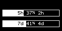

# Claude Code Limits on SteelSeries OLED

[](https://github.com/adonaipedro/claude-limits-steelseriesgg-oled/actions/workflows/tests.yml)

Local bridge that shows your Claude Code usage limits (5-hour + weekly) on the OLED
screen of a SteelSeries Arctis Nova Pro Wireless DAC / Base Station, via the GameSense
SDK. No third-party Python dependencies.

## Layout

Two bars, with the text rendered inside each one:



```text
[ 5h 37% 2h ]
[ 7d 41% 4d ]
```

- **5h**: 5-hour window limit, with remaining time in hours/minutes;
- **7d**: weekly all-models limit, with remaining time in days/hours.

## Requirements

- SteelSeries GG / Engine running (provides the GameSense local endpoint).
- Arctis Nova Pro Wireless DAC / Base Station (128×52 OLED).
- Python 3.
- Claude Code (for the live status-line feed).

## How it works

Two independent ways to feed the DAC:

1. **Status-line bridge** — Claude Code runs `claude_gamesense_statusline.py` as its
   `statusLine` command (about every 10s). It reads the limits from the status-line
   payload, renders the bars, and pushes them to the DAC over GameSense. Active only
   while Claude Code is open.
2. **Background daemon** (optional) — `dac_subscription_daemon.py` reads your Claude
   Code OAuth token, polls the Anthropic API for the subscription limits, and keeps
   the bars on the DAC **even with Claude Code closed**.

## Install on Windows

In PowerShell, inside this folder:

```powershell
powershell -ExecutionPolicy Bypass -File .\install_windows.ps1
```

This copies `claude_gamesense_statusline.py` to `~/.claude/`, points Claude Code's
`statusLine` at it, and seeds `dac_config.json` (see below). Then restart Claude Code
or send a message to force a status-line refresh.

## Background daemon (optional)

To show limits while Claude Code is closed, double-click **`start_dac.vbs`** — it
launches the daemon hidden (no console window) in a refresh loop. The daemon:

- reads the OAuth token from `~/.claude/.credentials.json` (log in via Claude Code
  once), refreshing it as needed;
- exits when SteelSeries GG is closed or the app is toggled off in GG, and is meant
  to be relaunched at the next logon.

## Display knobs (dac_config.json)

Optional behavior toggles live in `~/.claude/dac_config.json`, read at runtime by both
the status-line bridge and the background daemon:

```json
{
  "show_only_on_change": false,
  "change_display_seconds": 30
}
```

- `show_only_on_change` — `true` to show bars only when the 5h/7d usage % changes
  (default `false` = always on);
- `change_display_seconds` — how long bars stay visible after a change (default `30`).

The installer copies the repo's `dac_config.json` to `~/.claude/dac_config.json` on
first install, so you start with these defaults. It will **not** overwrite an existing
`~/.claude/dac_config.json`, so your edits survive reinstalls. Edit the file and
restart the status line / daemon to apply — no reinstall needed.

## Test without Claude Code

```powershell
python .\claude_gamesense_statusline.py --sample
```

## Tested

- **Confirmed working:** Arctis Nova Pro Wireless DAC / Base Station OLED (128×52) on
  Windows 11 — both the status-line bridge and the background daemon pushing frames,
  and the `--sample` render.
- **Not verified:** other SteelSeries OLED devices / resolutions. On macOS/Linux,
  `install_unix.sh` sets up the status-line feed only — the background daemon
  (`start_dac.vbs`, GG SQLite toggle, `pythonw`) is Windows-specific.
